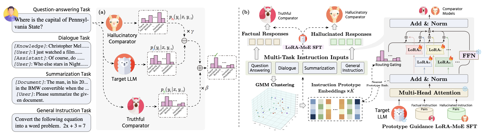

<div align="center">


# [Improving Factuality in Large Language Models via Decoding-Time Hallucinatory and Truthful Comparators](https://arxiv.org/pdf/2408.12325)  

<div>
  <b>Dingkang Yang</b><sup>1</sup>&emsp;
  <b>Dongling Xiao</b><sup>2</sup>&emsp;
  <b>Jinjie Wei</b><sup>1</sup>&emsp;
  <b>Mingcheng Li</b><sup>1</sup>&emsp;

  <b>Zhaoyu Chen</b><sup>1</sup>&emsp;
  <b>Ke Li</b><sup>3</sup>&emsp;
  <b>Lihua Zhang</b><sup>1</sup>&emsp;
</div>
<div><sup>1</sup>Fudan University</div>
<div><sup>2</sup>ByteDance</div>
<div><sup>3</sup>Tencent Youtu Lab</div>



</div>

## Abstract

Despite their remarkable capabilities, Large Language Models (LLMs) are prone to generate responses that contradict
verifiable facts, i.e., unfaithful hallucination content. Existing efforts generally focus on optimizing model parameters or editing semantic representations, which compromise the internal factual knowledge of target LLMs. In addition, hallucinations typically exhibit multifaceted patterns in downstream tasks, limiting the model’s holistic performance across tasks. In this paper, we propose a Comparator-driven Decoding-Time (CDT) framework to alleviate the response hallucination. Firstly, we construct hallucinatory and truthful comparators with multi-task fine-tuning samples. In this case, we present an instruction prototype-guided mixture of experts strategy to enhance the ability of the corresponding comparators to capture different hallucination or truthfulness patterns in distinct task instructions. CDT constrains next-token predictions to factuality-robust distributions by contrasting the
logit differences between the target LLMs and these comparators. Systematic experiments on multiple downstream tasks show that our framework can significantly improve the model performance and response factuality.


## Deploy

You can use the following commands to install the environment for CDT:

```sh
conda create -n cdt python==3.8
conda activate cdt
pip install -r requirements.txt
cd ./transformers
pip install --editable ./
```
## Datasets
The used datasets are organized as follows:
```sh
data
├── Alpaca_Gen
├── Alpaca_Judge
├── KNIGHT
├── truthfulqa
├── xsum
```
## Models
* Please access [here](https://huggingface.co/meta-llama) for the original llama models.
* The MoE-LoRA-based adaptors are used to collaborate with the base models to obtain the corresponding comparators.
* Please access [here](https://github.com/Tiiiger/bert_score) for testing BERTScore metrics.
* Please access [here](https://github.com/tagoyal/dae-factuality) for testing DAE metrics.   
* Please access [here](https://github.com/BunsenFeng/FactKB) for testing FACTKB metrics.   
```sh
llm_models
├── llama2-7b-base-cluster32-4moe-fact-adapter-hf # Truthful adaptor
├── llama2-7b-base-cluster32-4moe-halluc-adapter-hf # Hallucinatory adaptor
├── FactKB  # Test FactKB metrics
├── roberta-large  # Test BERTScore metrics

```

## Run

For experiments on different datasets, please try:
```sh
cd ./exp_scripts/benchmark
sh ${dataset_name}.sh
```

## Acknowledgement
We are aware that our works are inspired by the following works, including but not limited to
* ICD: [https://github.com/HillZhang1999/ICD/tree/main](https://github.com/HillZhang1999/ICD/tree/main)
* LLaMA-Factory: [https://github.com/hiyouga/LLaMA-Factory](https://github.com/hiyouga/LLaMA-Factory)


Without these, nothing could happen in this repository.


If you are interested in our work, please cite:
```bib
@article{yang2024improving,
  title={Improving factuality in large language models via decoding-time hallucinatory and truthful comparators},
  author={Yang, Dingkang and Xiao, Dongling and Wei, Jinjie and Li, Mingcheng and Chen, Zhaoyu and Li, Ke and Zhang, Lihua},
  journal={arXiv preprint arXiv:2408.12325},
  year={2024}
}
```
